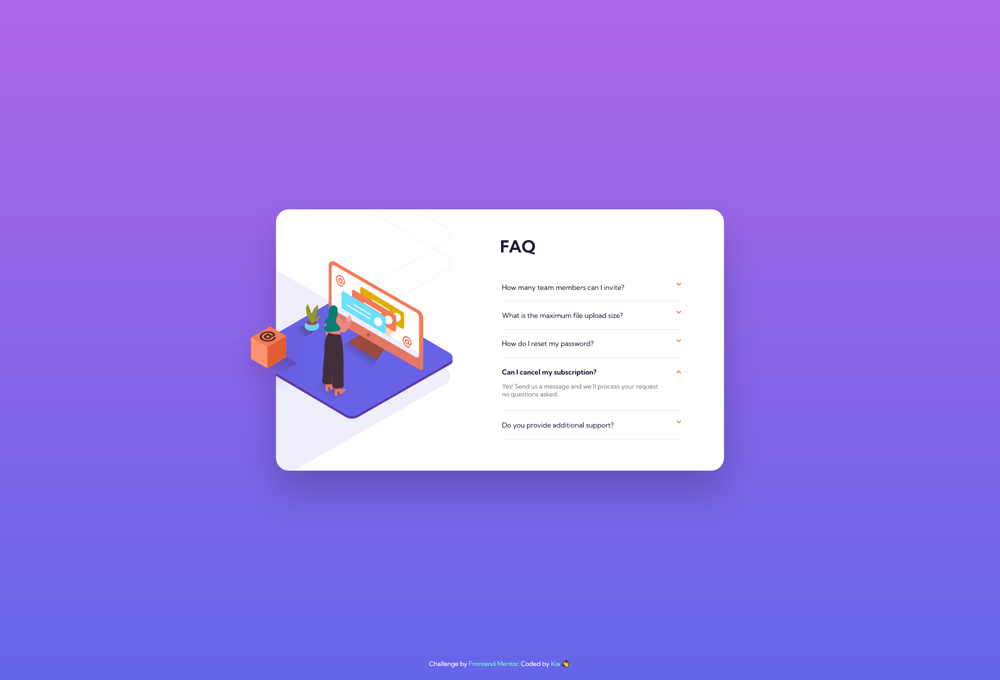

# Frontend Mentor - FAQ accordion card solution

This is a solution to the [FAQ accordion card challenge on Frontend Mentor](https://www.frontendmentor.io/challenges/faq-accordion-card-XlyjD0Oam). 

## Table of contents

- [Overview](#overview)
  - [The challenge](#the-challenge)
  - [Screenshot](#screenshot)
- [My process](#my-process)
  - [Built with](#built-with)
  - [What I learned](#what-i-learned)
  - [Continued development](#continued-development)

**Note: Delete this note and update the table of contents based on what sections you keep.**

## Overview

### The challenge

Users should be able to:

- View the optimal layout for the component depending on their device's screen size
- See hover states for all interactive elements on the page
- Hide/Show the answer to a question when the question is clicked

### Screenshot

## My process

### Built with

- HTML5
- CSS 
- Flexbox

### What I learned

CSS: 
- Position: relative & absolute - to put the img to exactly where we wanted
- Flexbox is really practical when it comes to center items: alight-item/ justfy-content
- transform: translate X/Y - to position items on the page 
- z-index 

JS
- .toggle() method - although very little JS still glad I've learnt something new ╰(*°▽°*)╯.

### Continued development

HTML:
- How to better name the classes 

CSS:
- specificity
- and lots of other confusing trucs...

